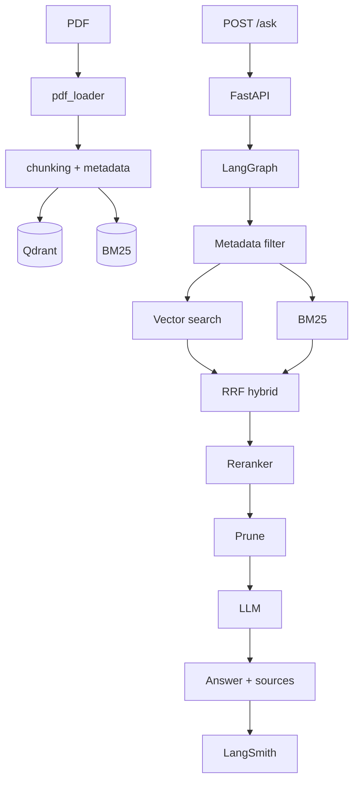
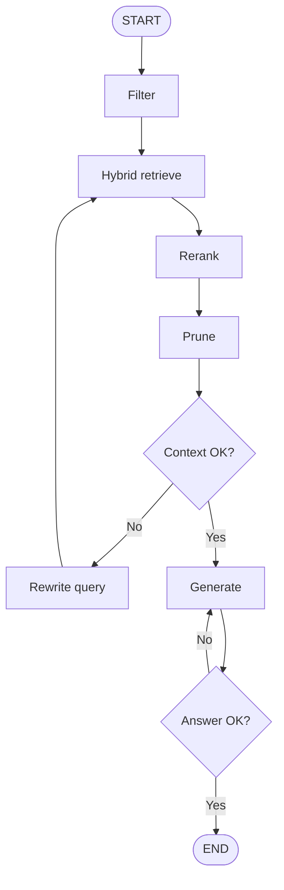
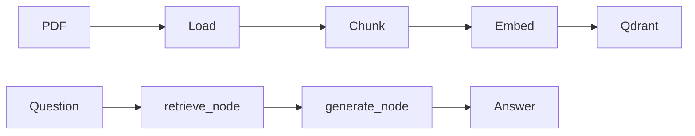
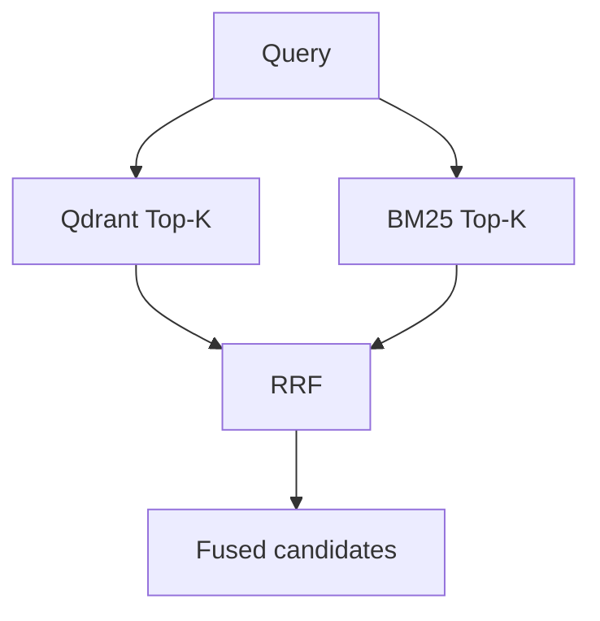
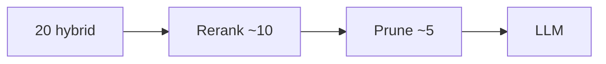
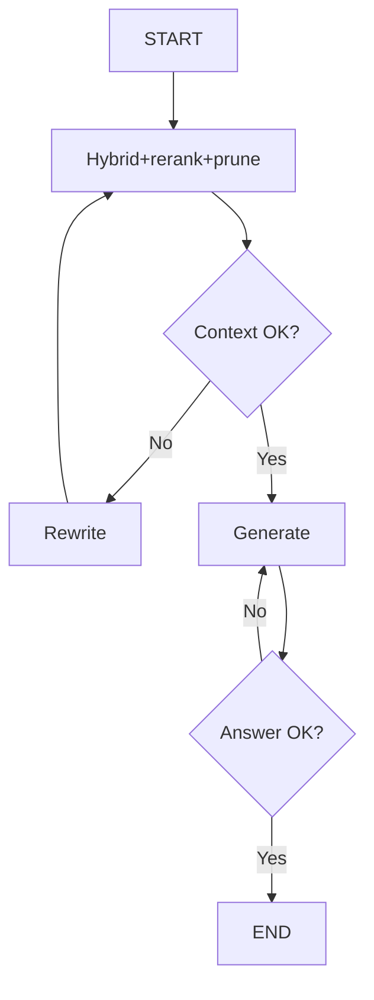

# Advanced RAG Pipeline — Step-by-Step Plan

Production RAG: Hybrid Search + Reranker + Metadata Filtering + Context Pruning + Prompt Cache + LangSmith.

**Orchestration: LangGraph only.** No LangChain chains, LCEL, or LangChain retrievers. Components are plain Python (PyMuPDF, Qdrant, BM25). LangGraph wires them as nodes.

**Out of scope for now:** Semantic cache (Redis). Later add kar sakte ho; abhi mat banana.

**GitHub rule:** Har phase complete + locally chalane ke baad **ek push / PR**. Next phase tab start jab previous GitHub pe ho.

---

## Stack (locked)

| Layer | Choice |
|-------|--------|
| Orchestration | **LangGraph only** (`StateGraph`) |
| API | FastAPI |
| PDF | PyMuPDF |
| Chunking | Custom splitter (no LangChain splitter) |
| Embeddings | BGE / E5 (`sentence-transformers`) |
| Vector DB | Qdrant |
| Keyword | BM25 (`rank-bm25`) |
| Fusion | RRF |
| Rerank | Cross-encoder |
| LLM | Gemini or OpenAI SDK |
| Observability | LangSmith |

---

## Current repo (empty skeleton — keep names)

```text
app/main.py, config.py
app/models/schemas.py
app/core/pdf_loader.py, chunking.py, embeddings.py, vectorstore.py, rag_chain.py
app/api/routes.py
data/source_pdfs/, vectorstore_db/, tests/, notebooks/
.env.example, .gitignore, requirements.txt, README.md
```

`rag_chain.py` = thin wrapper: `run_rag(question)` → `graph.invoke(...)`. Graph logic `app/graph/` mein.

---

## Target files (phase ke sath add honge)

```text
app/
  main.py, config.py
  models/schemas.py
  core/          # plain Python helpers (LangGraph nodes inhe call karte hain)
    pdf_loader.py, chunking.py, embeddings.py, vectorstore.py
    bm25.py, hybrid.py, metadata.py, reranker.py, pruning.py
    prompts.py, llm.py
    rag_chain.py              # graph.invoke wrapper only
  graph/         # LangGraph ONLY
    state.py, nodes.py, pipeline.py
  eval/
    tracing.py, dataset.py, evaluators.py
  api/routes.py
data/source_pdfs/, data/eval/rag_eval.jsonl
tests/, notebooks/01_benchmark_baseline_vs_advanced.ipynb
```

---

## End architecture



LangGraph (simple → advanced):



Phase 1–2 mein ye graph **linear** hoga (`retrieve → generate`). Phase 6 mein rewrite / retry add.

---

# GitHub phases (8 pushes)

Har phase ke end pe:

```text
git add ...
git commit -m "feat: <phase message>"
git push
```

Branch idea: `main` ya `phase-1` → `phase-2` ... Merge/PR after each phase.

---

# PHASE 1 — Setup + Basic LangGraph RAG

**GitHub push 1.** Goal: PDF → chunks → Qdrant → LangGraph (`retrieve → generate`) → answer. No API.

### Files

| File | Action | Andar kya |
|------|--------|-----------|
| `requirements.txt` | fill | fastapi, uvicorn, langgraph, pymupdf, qdrant-client, sentence-transformers, pydantic-settings, google-genai or openai, python-dotenv |
| `.env.example` | fill | API keys, Qdrant URL, model names, chunk size |
| `.gitignore` | fill | `.env`, `.venv`, `__pycache__`, `vectorstore_db/*` |
| `app/config.py` | fill | Settings from env |
| `app/core/pdf_loader.py` | fill | PyMuPDF: page text + `page` + `document` |
| `app/core/chunking.py` | fill | Recursive split by size/overlap; `chunk_id` |
| `app/core/embeddings.py` | fill | `embed_query`, `embed_documents` |
| `app/core/vectorstore.py` | fill | Qdrant upsert + similarity search |
| `app/core/llm.py` | fill | `generate(prompt) → str` |
| `app/core/prompts.py` | fill | System + context + question template |
| `app/graph/state.py` | **new** | `question`, `retrieved`, `answer`, `sources` |
| `app/graph/nodes.py` | **new** | `retrieve_node`, `generate_node` |
| `app/graph/pipeline.py` | **new** | Linear graph: retrieve → generate |
| `app/core/rag_chain.py` | fill | `run_rag(q)` → `graph.invoke` |

### Steps

1. Dependencies + `.env` + `config.py`.
2. Load one PDF from `data/source_pdfs/`.
3. Chunk + embed + upsert Qdrant.
4. LangGraph state + 2 nodes + compile.
5. Script/notebook se ek question chalao.



### Done when

Terminal se question ka answer aaye, sources mein page number ho (basic metadata).

### GitHub

```text
feat: add basic LangGraph RAG ingest and retrieve-generate graph
```

---

# PHASE 2 — FastAPI `/ingest` + `/ask`

**GitHub push 2.** Goal: HTTP API. Graph same as Phase 1.

### Files

| File | Action | Andar kya |
|------|--------|-----------|
| `app/models/schemas.py` | fill | `AskRequest`, `AskResponse`, `Source`, `IngestResponse` |
| `app/api/routes.py` | fill | `POST /ingest`, `POST /ask`, `GET /health` |
| `app/main.py` | fill | FastAPI app, include router, lifespan |
| `tests/test_api.py` | fill | health + ask response shape |
| `README.md` | update | how to run |

### Steps

1. Pydantic schemas.
2. `/ingest` → loader → chunk → embed → Qdrant.
3. `/ask` → `run_rag` → JSON `{answer, sources}`.
4. `uvicorn app.main:app --reload`.
5. Curl/Postman se test.

### Done when

```text
POST /ask  {"question": "What is RAG?"}
→ { "answer": "...", "sources": [{ "page": 3, "document": "..." }] }
```

### GitHub

```text
feat: expose LangGraph RAG via FastAPI ingest and ask endpoints
```

---

# PHASE 3 — Metadata filtering + citations

**GitHub push 3.** Goal: rich metadata + optional filters before search.

### Files

| File | Action | Andar kya |
|------|--------|-----------|
| `app/core/chunking.py` | edit | `section` heading heuristic + `chunk_id` |
| `app/core/metadata.py` | **new** | `AskRequest.filters` → Qdrant filter |
| `app/core/vectorstore.py` | edit | search with filter; payload indexes |
| `app/graph/state.py` | edit | `filters` field |
| `app/graph/nodes.py` | edit | retrieve uses filters |
| `app/models/schemas.py` | edit | `filters`, full `Source` |

### Steps

1. Har chunk: `page`, `section`, `document`, `chunk_id`.
2. Qdrant payload index on those fields.
3. `/ask` body mein optional `filters`.
4. Response sources complete.

### Done when

```json
{ "question": "...", "filters": { "section": "Retrieval", "page_gte": 10 } }
```

sirf matching chunks retrieve hon.

### GitHub

```text
feat: add chunk metadata, page citations, and Qdrant filters
```

---

# PHASE 4 — BM25 + Hybrid RRF

**GitHub push 4.** Goal: dense + keyword → RRF. Still linear LangGraph, retrieve node ke andar hybrid.

### Files

| File | Action | Andar kya |
|------|--------|-----------|
| `app/core/bm25.py` | **new** | Build/search BM25; persist corpus |
| `app/core/hybrid.py` | **new** | RRF fusion |
| `app/graph/nodes.py` | edit | `retrieve_node` = vector + BM25 + RRF |
| `app/api/routes.py` | edit | ingest also rebuilds BM25 |
| `tests/test_hybrid.py` | **new** | RRF unique ids, rank merge |



### Steps

1. Ingest pe BM25 index banao.
2. Query pe dono search.
3. RRF: `score = Σ 1/(60 + rank)`.
4. Fused list generate node ko do.

### Done when

Exact terms (`GPT-4o-mini`) aur conceptual questions dono `/ask` pe theek kaam karein.

### GitHub

```text
feat: add BM25 and hybrid RRF retrieval in LangGraph retrieve node
```

---

# PHASE 5 — Reranker + context pruning

**GitHub push 5.** Goal: fused → rerank → prune → LLM. Graph ab 4 nodes: retrieve → rerank → prune → generate.

### Files

| File | Action | Andar kya |
|------|--------|-----------|
| `app/core/reranker.py` | **new** | Cross-encoder `(query, chunk)` scores |
| `app/core/pruning.py` | **new** | Drop low score, duplicates, token cap |
| `app/graph/state.py` | edit | `reranked`, `pruned` |
| `app/graph/nodes.py` | edit | `rerank_node`, `prune_node` |
| `app/graph/pipeline.py` | edit | retrieve → rerank → prune → generate |
| `app/config.py` | edit | `retrieve_k=20`, `rerank_k=10`, `prune_k=5` |
| `tests/test_reranker.py` | **new** | order changes |
| `tests/test_pruning.py` | **new** | low-score / overlap dropped |



### Steps

1. Rerank fused candidates.
2. Prune: threshold + overlap + token budget.
3. Graph edges update.
4. Prompt tokens kam, answer noise kam.

### Done when

LLM ko ~5 chunks milte hain; sample questions pe quality same/better, tokens down.

### GitHub

```text
feat: add cross-encoder rerank and context pruning graph nodes
```

---

# PHASE 6 — Graph decisions (rewrite + retry)

**GitHub push 6.** Goal: conditional edges — poor context → rewrite query; poor answer → retry generate. Yahan LangGraph justified hai.

Semantic cache **nahi**. Redis / `cache.py` / `cache_hit` skip.

### Files

| File | Action | Andar kya |
|------|--------|-----------|
| `app/graph/state.py` | edit | `rewritten_query`, `context_ok`, `retry_count` |
| `app/graph/nodes.py` | edit | `quality_check`, `rewrite_query` |
| `app/graph/pipeline.py` | edit | conditional edges |
| `app/models/schemas.py` | edit | `latency_ms` |



### Steps

1. Context quality check after prune (max 1–2 retrieve retries).
2. Poor context → rewrite query → retrieve again.
3. Poor answer → regenerate once.

### Done when

Weak first retrieval pe graph rewrite karke better chunks laaye; `/ask` still kaam kare.

### GitHub

```text
feat: add LangGraph rewrite and retry edges for retrieval quality
```

---

# PHASE 7 — Prompt caching + LangSmith tracing

**GitHub push 7.** Goal: stable prompt prefix (provider cache) + traces.

### Files

| File | Action | Andar kya |
|------|--------|-----------|
| `app/core/prompts.py` | edit | Static system+instructions first; chunks+question last |
| `app/core/llm.py` | edit | Provider prompt-cache flags |
| `app/eval/tracing.py` | **new** | LangSmith env + wrap invoke |
| `.env.example` | edit | `LANGSMITH_API_KEY`, `LANGSMITH_PROJECT` |
| `README.md` | update | tracing setup |

Prompt cache Redis mein **nahi** banana. Provider KV-cache hai.

### Steps

1. Prefix freeze (same bytes every call).
2. Enable Gemini/OpenAI/Anthropic cache option.
3. `LANGCHAIN_TRACING_V2` / LangSmith — LangGraph spans dikhein.
4. `/ask` ka trace: retrieve, rerank, prune, generate (rewrite/retry if used).

### Done when

LangSmith UI mein node spans + prompt-cache-read / token usage dikhe.

### GitHub

```text
feat: enable prompt caching and LangSmith tracing on the graph
```

---

# PHASE 8 — Evaluation + baseline vs advanced

**GitHub push 8.** Goal: numbers. Interview point: hybrid+rerank+prune vs baseline.

### Files

| File | Action | Andar kya |
|------|--------|-----------|
| `data/eval/rag_eval.jsonl` | **new** | `question`, `reference_answer`, `expected_pages` |
| `app/eval/dataset.py` | **new** | load + upload LangSmith dataset |
| `app/eval/evaluators.py` | **new** | recall, precision, hit rate, MRR, faithfulness, relevance, latency, tokens |
| `notebooks/01_benchmark_baseline_vs_advanced.ipynb` | **new** | side-by-side |
| `README.md` | update | how to run eval |

### Steps

1. 20–40 questions from the PDF.
2. Run baseline graph (vector → generate) vs full graph.
3. Table: retrieval + generation + system metrics.
4. Screenshot / notebook for demo.

### Done when

Ek table dikhaye ke advanced pipeline baseline se better hai.

### GitHub

```text
feat: add LangSmith eval dataset and baseline vs advanced benchmark
```

---

## Phase → GitHub checklist

| Push | Phase | Branch suggestion | Commit |
|------|-------|-------------------|--------|
| 1 | Basic LangGraph RAG | `feat/phase-1-basic-rag` | `feat: add basic LangGraph RAG ingest and retrieve-generate graph` |
| 2 | FastAPI | `feat/phase-2-fastapi` | `feat: expose LangGraph RAG via FastAPI ingest and ask endpoints` |
| 3 | Metadata + filters | `feat/phase-3-metadata` | `feat: add chunk metadata, page citations, and Qdrant filters` |
| 4 | Hybrid RRF | `feat/phase-4-hybrid` | `feat: add BM25 and hybrid RRF retrieval in LangGraph retrieve node` |
| 5 | Rerank + prune | `feat/phase-5-rerank-prune` | `feat: add cross-encoder rerank and context pruning graph nodes` |
| 6 | Rewrite + retry | `feat/phase-6-graph-decisions` | `feat: add LangGraph rewrite and retry edges for retrieval quality` |
| 7 | Prompt cache + traces | `feat/phase-7-observability` | `feat: enable prompt caching and LangSmith tracing on the graph` |
| 8 | Eval + benchmark | `feat/phase-8-evaluation` | `feat: add LangSmith eval dataset and baseline vs advanced benchmark` |

Har push ke baad README mein **current phase** + how to run update karo.

---

## Graph growth (same pipeline file, phases mein expand)

| Phase | Nodes | Edges |
|-------|-------|-------|
| 1–2 | retrieve → generate | linear |
| 3 | retrieve(filter) → generate | linear |
| 4 | retrieve(hybrid) → generate | linear |
| 5 | retrieve → rerank → prune → generate | linear |
| 6+ | rewrite, retry | **conditional** |

---

## API (final)

`POST /ingest`

```json
{ "pdf_path": "data/source_pdfs/rag.pdf" }
```

`POST /ask`

```json
{
  "question": "What is RAG?",
  "filters": { "section": "Retrieval", "page_gte": 10 }
}
```

```json
{
  "answer": "...",
  "sources": [{ "document": "rag.pdf", "page": 3, "section": "Introduction", "chunk_id": "chunk_12", "score": 0.91 }],
  "latency_ms": 1420
}
```

---

## Rules

- **LangGraph only** — no LangChain `Chain` / LCEL / `RetrievalQA`.
- `routes.py` sirf `rag_chain.run_rag` / ingest helpers call kare. Qdrant/BM25 direct nahi.
- Semantic cache (Redis) **abhi nahi**. Prompt cache = LLM provider prefix reuse (Phase 7) — alag cheez hai.
- Phase skip mat karo. Phase 6 se pehle 1–5 locally kaam karein.
- Phase 8 ke bina ye feature dump hai, RAG engineering nahi.

---

## Ab kya karna hai

Phase 1 se start: `requirements.txt` + `config.py` + loader/chunk/embed/vectorstore + 2-node LangGraph. PDF `data/source_pdfs/` mein rakho. API Phase 2 mein.
