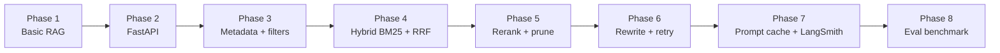
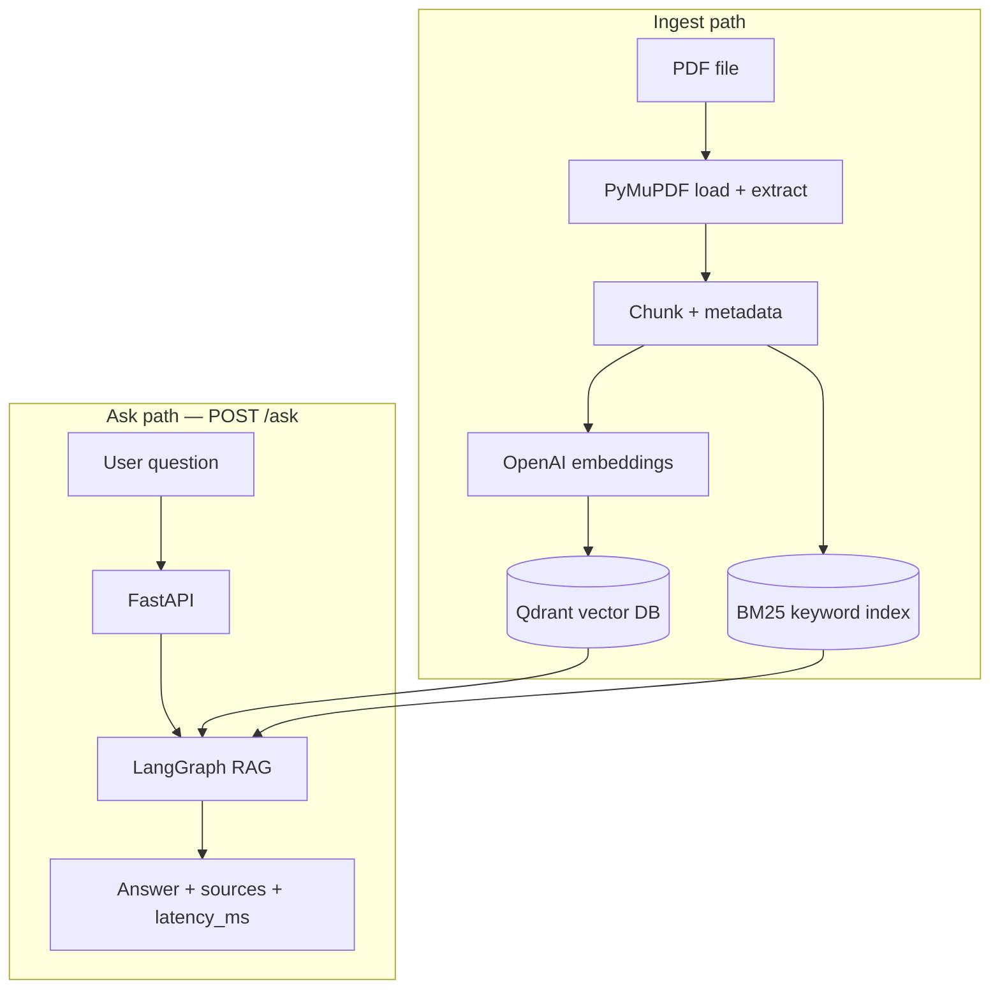
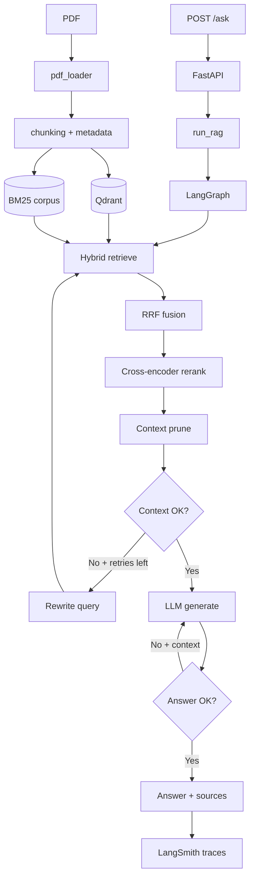
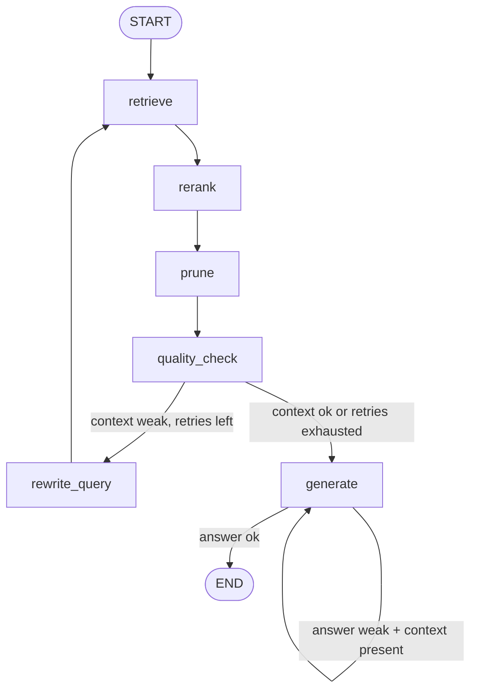
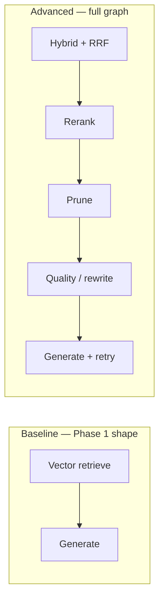
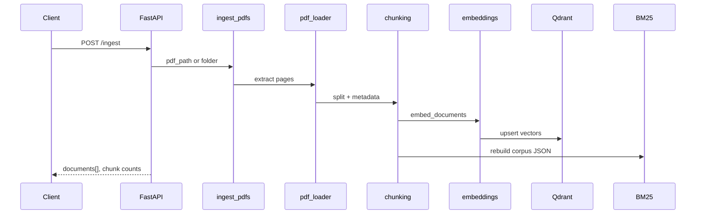
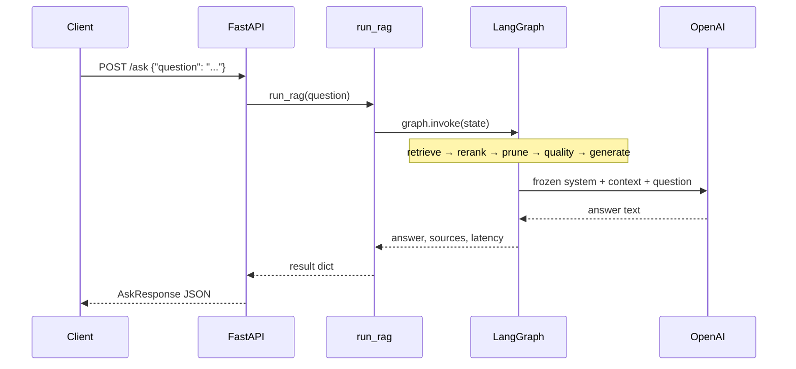
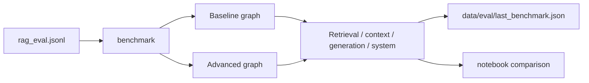

# PDF-based RAG Application

A FastAPI + LangGraph Retrieval-Augmented Generation (RAG) system that answers questions from PDF documents with **page-level source citations**.

Built for the Archle Labs assignment: load a PDF, chunk it, embed and store vectors, retrieve relevant context, and generate a grounded answer through `POST /ask`.

---

## Table of contents

1. [Approach behind this project](#approach-behind-this-project)
2. [Project overview](#project-overview)
3. [Tech stack](#tech-stack)
4. [System architecture](#system-architecture)
5. [RAG pipeline (required features)](#rag-pipeline-required-features)
6. [Optional features implemented](#optional-features-implemented)
7. [Model choices and reasons](#model-choices-and-reasons)
8. [Project structure](#project-structure)
9. [Setup instructions](#setup-instructions)
10. [Steps to run the FastAPI server](#steps-to-run-the-fastapi-server)
11. [API endpoint details](#api-endpoint-details)
12. [Example questions and responses](#example-questions-and-responses)
13. [CLI usage](#cli-usage)
14. [Evaluation](#evaluation)
15. [LangSmith tracing](#langsmith-tracing)
16. [Tests](#tests)
17. [Demo video](#demo-video)
18. [Limitations](#limitations)
19. [Commit history](#commit-history)

---

## Approach behind this project

The goal was not just to “call an LLM with a PDF.” The goal was to build a **clear, phased RAG system** where each stage improves answer quality in a measurable way.

### Design principles

| Principle | What it means here |
|-----------|--------------------|
| **Required first, optional later** | Phase 1–2 deliver PDF → chunks → vectors → `POST /ask`. Advanced pieces (hybrid, rerank, rewrite, eval) come only after that works. |
| **LangGraph as the orchestrator** | Nodes are plain Python (PyMuPDF, Qdrant, BM25). LangGraph wires them — no LangChain LCEL / RetrievalQA chains. |
| **Ground every answer** | The LLM only sees pruned retrieved chunks. Responses include `document`, `page`, `section`, and `chunk_id`. |
| **Dense + sparse retrieval** | Vector search catches meaning; BM25 catches exact terms (model names, URLs, acronyms). RRF fuses both. |
| **Narrow the context before generate** | Hybrid top-20 → rerank top-10 → prune ~5. Fewer tokens, less noise, stronger grounding. |
| **Recover when retrieval is weak** | If context scores are low, rewrite the query and retrieve again. If the answer is a refusal with usable context, regenerate once. |
| **Observe and measure** | LangSmith traces every node. A 30-question gold set compares baseline vs advanced. |

### How the project grew (phased build)



| Phase | Deliverable |
|-------|-------------|
| 1 | PDF load → chunk → embed → Qdrant → LangGraph `retrieve → generate` |
| 2 | FastAPI `POST /ingest`, `POST /ask`, `GET /health` |
| 3 | Rich metadata (`page`, `section`, `chunk_id`) + filterable search |
| 4 | BM25 + Reciprocal Rank Fusion hybrid retrieval |
| 5 | Cross-encoder rerank + context pruning |
| 6 | Conditional rewrite / retry edges in LangGraph |
| 7 | Frozen system prompt (OpenAI prompt cache) + LangSmith spans |
| 8 | Gold set + baseline vs advanced metrics |

This matches the assignment rule: **optional features only after the required pipeline and endpoint work**.

---

## Project overview



**What you get**

- Upload / ingest one or more PDFs into a local (or remote) Qdrant store
- Ask natural-language questions over that content
- Receive an answer **plus source references** (page / section / chunk)
- Optional observability (LangSmith) and a reproducible eval harness

---

## Tech stack

| Layer | Choice | Role |
|-------|--------|------|
| API | **FastAPI** + Uvicorn | HTTP surface (`/health`, `/ingest`, `/ask`) |
| Orchestration | **LangGraph** (`StateGraph`) | RAG workflow nodes + conditional edges |
| PDF | **PyMuPDF** (`fitz`) | Text (and table/figure) extraction |
| Chunking | Custom splitter | ~800 chars, 150 overlap, section heuristics |
| Embeddings | OpenAI **`text-embedding-3-small`** | Dense vectors (1536-d) |
| Vector DB | **Qdrant** (embedded on disk by default) | Similarity search |
| Keyword | **BM25** (`rank-bm25`) | Sparse / exact-term retrieval |
| Fusion | **RRF** | Merge dense + sparse rankings |
| Rerank | **Cross-encoder** MiniLM | Score `(query, chunk)` pairs |
| Generate | OpenAI **`gpt-4.1-mini`** | Grounded answer from pruned context |
| Rewrite | OpenAI **`gpt-5.4-nano`** | Query rewrite on weak context |
| Schemas | Pydantic / pydantic-settings | Request/response + config from `.env` |
| Observability | **LangSmith** | Node spans, tokens, prompt-cache reads |
| Eval | Custom JSONL + CLI / notebook | Baseline vs advanced metrics |

---

## System architecture

### End-to-end flow



### LangGraph (advanced pipeline)



### Baseline vs advanced (for eval)



---

## RAG pipeline (required features)

Every required assignment item is implemented:

| Requirement | Implementation |
|-------------|----------------|
| PDF loading | `app/core/pdf_loader.py` (PyMuPDF) |
| Text extraction | Page text (+ tables/figures when present) |
| Text chunking | `app/core/chunking.py` (`CHUNK_SIZE=800`, `CHUNK_OVERLAP=150`) |
| Embedding generation | `app/core/embeddings.py` → OpenAI embed API |
| Vector database storage | `app/core/vectorstore.py` → Qdrant (`vectorstore_db/` by default) |
| Similarity search | Dense Qdrant search inside `retrieve_node` |
| Answer generation from context | `generate_node` + `app/core/llm.py` / `prompts.py` |
| Source references | Response `sources[]` with `document`, `page`, `section`, `chunk_id`, `score` |
| FastAPI `POST /ask` | `app/api/routes.py` |
| LangGraph pipeline | `app/graph/pipeline.py` + `nodes.py` + `state.py` |

### Ingest pipeline detail



### Ask pipeline detail



---

## Optional features implemented

| Optional feature | Status | Where |
|------------------|--------|-------|
| LangGraph workflow | Done | Conditional rewrite + generate retry |
| Hybrid search | Done | Qdrant + BM25 → RRF |
| Reranking | Done | `cross-encoder/ms-marco-MiniLM-L-6-v2` |
| Caching | Partial | OpenAI **prompt cache** (frozen system prefix). Not Redis semantic cache. |
| Evaluation metrics | Done | Hit rate, recall, precision, MRR, faithfulness, relevance, latency |
| LangSmith tracing | Done | Parent `rag_ask` + node spans |
| Tool calling / Web API tools | Not included | Kept out of scope for a focused PDF RAG |

---

## Model choices and reasons

This is a PDF Q&A job: **long retrieved context in, short grounded answer out**. No vision agent, no coding agent.

| Job | Model | Why |
|-----|-------|-----|
| Embed chunks + queries | `text-embedding-3-small` | Strong English retrieval at low cost (~$0.02 / 1M tokens). ~99% of `large` quality for typical RAG. |
| Embed upgrade (optional) | `text-embedding-3-large` | Use only if recall on *this* corpus is weak. Requires re-ingest (3072-d). |
| Answer generation | `gpt-4.1-mini` | Strong instruction following on grounded Q&A, cheap on long prompts, no reasoning delay. |
| Query rewrite | `gpt-5.4-nano` | Light helper for rewrite / classify-style graph steps. |
| Harder generate (optional) | `gpt-5.4-mini` | Multi-hop or weak table synthesis — costlier, can add latency. |
| Rerank (local) | MiniLM cross-encoder | Fast pairwise relevance without another LLM call. |

**Not used on purpose:** `text-embedding-ada-002` (older / weaker / costlier than `3-small`) and `gpt-4o-mini` (superseded by `gpt-4.1-mini` for this text RAG workload).

Configure via `.env`:

```text
OPENAI_API_KEY=...
OPENAI_MODEL=gpt-4.1-mini
REWRITE_MODEL=gpt-5.4-nano
EMBEDDING_MODEL=text-embedding-3-small
```

After changing the embedding model, **re-ingest** (vector dimensions change).

---

## Project structure

```text
app/
  main.py                 # FastAPI app entry
  config.py               # Settings from .env
  cli.py                  # ingest / ask / eval CLI
  api/routes.py           # GET /health, POST /ingest, POST /ask
  models/schemas.py       # Pydantic request/response models
  core/                   # Plain Python helpers (called by graph nodes)
    pdf_loader.py
    chunking.py
    embeddings.py
    vectorstore.py
    bm25.py
    hybrid.py
    metadata.py
    reranker.py
    pruning.py
    prompts.py
    llm.py
    ingest.py
    rag_chain.py          # thin wrapper → graph.invoke
  graph/                  # LangGraph only
    state.py
    nodes.py
    pipeline.py
  eval/
    tracing.py
    dataset.py
    evaluators.py
    benchmark.py
data/
  source_pdfs/            # Put PDFs here
  eval/rag_eval.jsonl     # 30 gold questions
tests/
notebooks/
  01_benchmark_baseline_vs_advanced.ipynb
.env.example
requirements.txt
PLANNING.md
README.md
```

---

## Setup instructions

### 1. Clone and create a virtualenv

```bash
git clone <your-repo-url>
cd "Rag Pipeline"

python -m venv .venv
```

**Windows (PowerShell):**

```powershell
.venv\Scripts\activate
pip install -r requirements.txt
copy .env.example .env
```

**macOS / Linux:**

```bash
source .venv/bin/activate
pip install -r requirements.txt
cp .env.example .env
```

### 2. Configure environment

Edit `.env` and set at least:

```text
OPENAI_API_KEY=sk-...
```

Useful defaults already in `.env.example`:

| Variable | Default | Meaning |
|----------|---------|---------|
| `EMBEDDING_MODEL` | `text-embedding-3-small` | Dense embeddings |
| `OPENAI_MODEL` | `gpt-4.1-mini` | Answer generation |
| `REWRITE_MODEL` | `gpt-5.4-nano` | Query rewrite |
| `QDRANT_PATH` | `vectorstore_db` | Local embedded Qdrant (no Docker) |
| `CHUNK_SIZE` / `CHUNK_OVERLAP` | `800` / `150` | Chunking |
| `RETRIEVE_K` / `RERANK_K` / `PRUNE_K` | `20` / `10` / `5` | Retrieval funnel |
| `LANGSMITH_API_KEY` | empty | Optional tracing |

Leave `QDRANT_URL` empty to use **embedded on-disk** Qdrant under `vectorstore_db/`. BM25 corpus is stored at `vectorstore_db/bm25_corpus.json`.

### 3. Add a PDF

Place your PDF in:

```text
data/source_pdfs/
```

Example: `data/source_pdfs/Document.pdf`

---

## Steps to run the FastAPI server

From the repo root (venv activated):

```bash
uvicorn app.main:app --reload
```

Open interactive docs: [http://127.0.0.1:8000/docs](http://127.0.0.1:8000/docs)

### Recommended order


1. Confirm the server is up  
2. Ingest the PDF(s)  
3. Ask questions  

---

## API endpoint details

### `GET /health`

Liveness check (does not touch Qdrant or the LLM).

```bash
curl http://127.0.0.1:8000/health
```

```json
{ "status": "ok" }
```

---

### `POST /ingest`

Load PDF text → chunk → embed → upsert Qdrant → rebuild BM25.

**One file:**

```bash
curl -X POST http://127.0.0.1:8000/ingest ^
  -H "Content-Type: application/json" ^
  -d "{\"pdf_path\": \"data/source_pdfs/Document.pdf\"}"
```

**All PDFs in `data/source_pdfs/`** (creates a sample PDF if the folder is empty):

```bash
curl -X POST http://127.0.0.1:8000/ingest ^
  -H "Content-Type: application/json" ^
  -d "{}"
```

**Example response:**

```json
{
  "message": "Ingested Document.pdf.",
  "documents": [
    {
      "document": "Document.pdf",
      "pages": 42,
      "chunks": 180,
      "tables": 3,
      "figures": 1
    }
  ]
}
```

---

### `POST /ask` (required)

Accepts a user question and returns an answer grounded in retrieved PDF chunks, with source references.

**Request**

```json
{
  "question": "What is Retrieval-Augmented Generation?"
}
```

**Response shape**

```json
{
  "answer": "Retrieval-Augmented Generation is a technique that combines information retrieval with text generation...",
  "sources": [
    {
      "document": "Document.pdf",
      "page": 1,
      "section": "Introduction",
      "chunk_id": "chunk_3",
      "score": 5.12,
      "content_type": "text"
    }
  ],
  "latency_ms": 1420
}
```

| Field | Meaning |
|-------|---------|
| `answer` | LLM answer grounded in pruned chunks |
| `sources` | Chunks actually sent to the LLM (~`PRUNE_K`) |
| `sources[].page` | PDF page number citation |
| `sources[].score` | Cross-encoder relevance score |
| `latency_ms` | LangGraph wall time in milliseconds |

**cURL (Windows cmd):**

```bash
curl -X POST http://127.0.0.1:8000/ask ^
  -H "Content-Type: application/json" ^
  -d "{\"question\": \"What is Retrieval-Augmented Generation?\"}"
```

**cURL (PowerShell):**

```powershell
Invoke-RestMethod -Method Post -Uri http://127.0.0.1:8000/ask `
  -ContentType "application/json" `
  -Body '{"question":"What is Retrieval-Augmented Generation?"}'
```

Exact-term query (BM25 helps):

```bash
curl -X POST http://127.0.0.1:8000/ask -H "Content-Type: application/json" -d "{\"question\": \"GPT-4o-mini\"}"
```

---

## Example questions and responses

Examples below assume `Document.pdf` (RAG survey-style source) has been ingested. Answers will vary slightly by model sampling; structure stays the same.

### Example 1 — Conceptual

**Request**

```json
{
  "question": "What LLM challenges does Retrieval-Augmented Generation address?"
}
```

**Response (illustrative)**

```json
{
  "answer": "RAG addresses hallucination, outdated knowledge, and non-transparent, untraceable reasoning by retrieving external knowledge instead of relying only on parametric memory.",
  "sources": [
    {
      "document": "Document.pdf",
      "page": 1,
      "section": "Introduction",
      "chunk_id": "chunk_2",
      "score": 8.41
    }
  ],
  "latency_ms": 1680
}
```

### Example 2 — Taxonomy

**Request**

```json
{
  "question": "What three RAG paradigms does the survey examine?"
}
```

**Response (illustrative)**

```json
{
  "answer": "The survey covers Naive RAG, Advanced RAG, and Modular RAG.",
  "sources": [
    {
      "document": "Document.pdf",
      "page": 1,
      "section": "Introduction",
      "chunk_id": "chunk_5",
      "score": 7.92
    },
    {
      "document": "Document.pdf",
      "page": 2,
      "section": "Paradigms",
      "chunk_id": "chunk_8",
      "score": 6.55
    }
  ],
  "latency_ms": 1540
}
```

### Example 3 — Assignment-style wording

**Request**

```json
{
  "question": "What is Retrieval-Augmented Generation?"
}
```

**Response (illustrative)**

```json
{
  "answer": "Retrieval-Augmented Generation is a technique that combines information retrieval with text generation so the model answers using retrieved external knowledge rather than parameters alone.",
  "sources": [
    {
      "document": "Document.pdf",
      "page": 1,
      "chunk_id": "chunk_1",
      "score": 9.01
    }
  ],
  "latency_ms": 1390
}
```

More gold questions live in `data/eval/rag_eval.jsonl`.

---

## CLI usage

```bash
python -m app.cli ingest
python -m app.cli ask "What is RAG?"
python -m app.cli ask "What is RAG?" --filters "{\"section\": \"Retrieval\", \"page_gte\": 10}"
python -m app.cli ask "What is RAG?" --pipeline baseline
```

- Default pipeline = full advanced graph  
- `--pipeline baseline` = vector-only retrieve → generate (for comparison)  
- CLI can pass **metadata filters** (`section`, `document`, `page`, `page_gte`, `page_lte`, `chunk_id`, `content_type`) even when the HTTP `/ask` body is question-only  

---

## Evaluation

Gold set: `data/eval/rag_eval.jsonl` (30 questions with `reference_answer` + `expected_pages`).

```bash
# ingest first, then:
python -m app.cli eval --limit 5
python -m app.cli eval
python -m app.cli eval --upload
```



| Group | Metrics |
|-------|---------|
| Retrieval | hit rate, recall, precision, MRR vs `expected_pages` |
| Context | hit rate / recall on pages sent to the LLM |
| Generation | faithfulness (grounded in context), relevance (token F1 vs reference) |
| System | `latency_ms`, estimated context tokens, answer tokens |

Side-by-side notebook: `notebooks/01_benchmark_baseline_vs_advanced.ipynb`  
(`RUN_LIVE = True` to call graphs, or load `last_benchmark.json` after CLI.)

---

## LangSmith tracing

1. Create a key at [smith.langchain.com](https://smith.langchain.com)  
2. Set in `.env`:

```text
LANGSMITH_TRACING=true
LANGSMITH_API_KEY=lsv2_...
LANGSMITH_PROJECT=rag-pipeline
```

3. Restart the API, call `POST /ask`, open the LangSmith project  

One `/ask` should show parent run `rag_ask` with spans for `retrieve`, `rerank`, `prune`, `quality_check`, `generate`, and `rewrite_query` when rewrite ran. Prompt-cache hits appear under token details after the frozen system prefix is warm (~1024+ matching tokens).

Leave `LANGSMITH_API_KEY` empty to run without traces.

---

## Tests

```bash
python -m unittest tests.test_api tests.test_bm25 tests.test_chunking tests.test_eval tests.test_graph_decisions tests.test_hybrid tests.test_metadata tests.test_observability tests.test_pdf_loader tests.test_pruning tests.test_reranker
```

API / graph-decision / observability / eval unit tests mock external calls where needed so they do not require a live OpenAI key.

---

## Demo video
https://youtu.be/J6OdC6DpTBg


---

## Limitations

| Limitation | Detail |
|------------|--------|
| PDF quality dependent | Scanned / image-only PDFs need OCR; this stack extracts digital text. |
| Single-corpus focus | Tuned for the ingested PDF(s); not a general web search agent. |
| No tool calling | No web API tools / agents — by design for this assignment. |
| No Redis semantic cache | Prompt cache is provider-side KV reuse of the frozen system prefix only. |
| Embedding model lock-in | Changing embed model requires full re-ingest. |
| Cross-encoder download | First rerank run may download MiniLM weights (needs network once). |
| Hallucination residual | Grounding reduces but does not eliminate LLM invention if context is thin. |
| Latency | Hybrid + rerank + optional rewrite adds latency vs baseline vector→generate. |
| Language | Prompting and eval assume primarily English content. |
| Main-branch workflow | Assignment asks for progress on `main` with multiple commits — keep history incremental. |

---

## Commit history

The repository is developed on **`main`** with incremental commits (not one giant dump), including:

- Initial project structure  
- Core PDF → embed → retrieve → generate path  
- FastAPI ingest / ask routes  
- Metadata, hybrid BM25 + RRF, rerank + prune  
- Rewrite / retry graph decisions  
- Observability + evaluation (as implemented in later commits)  

Final submission should include a **cleanup** commit after feature work (docs, unused files, secrets scrubbed).

---

## Quick reference

```bash
# setup
python -m venv .venv
.venv\Scripts\activate
pip install -r requirements.txt
copy .env.example .env   # set OPENAI_API_KEY

# run
uvicorn app.main:app --reload

# use
curl http://127.0.0.1:8000/health
curl -X POST http://127.0.0.1:8000/ingest -H "Content-Type: application/json" -d "{\"pdf_path\": \"data/source_pdfs/Document.pdf\"}"
curl -X POST http://127.0.0.1:8000/ask -H "Content-Type: application/json" -d "{\"question\": \"What is Retrieval-Augmented Generation?\"}"
```


